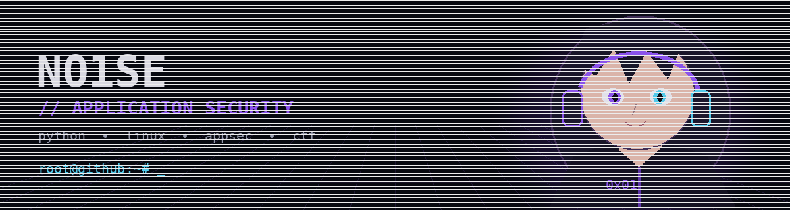
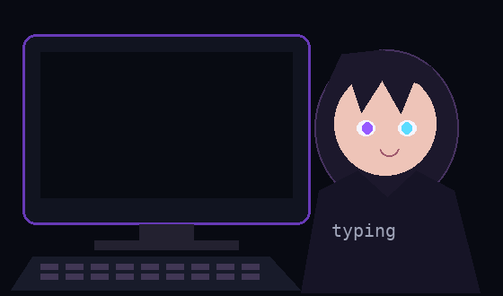

 

  

 

 

<table>
<tr>
<td width="55%" align="center">

</td>

<td width="45%" valign="middle">

### `whoami`

🔐 AppSec
🐧 Linux
🐳 DevSecOps
🚩 CTF
⚙️ Security Automation

</td>
</tr>
</table>

 

<h2 align="center">Featured projects</h2>

 

  

`root@github:~# █`

